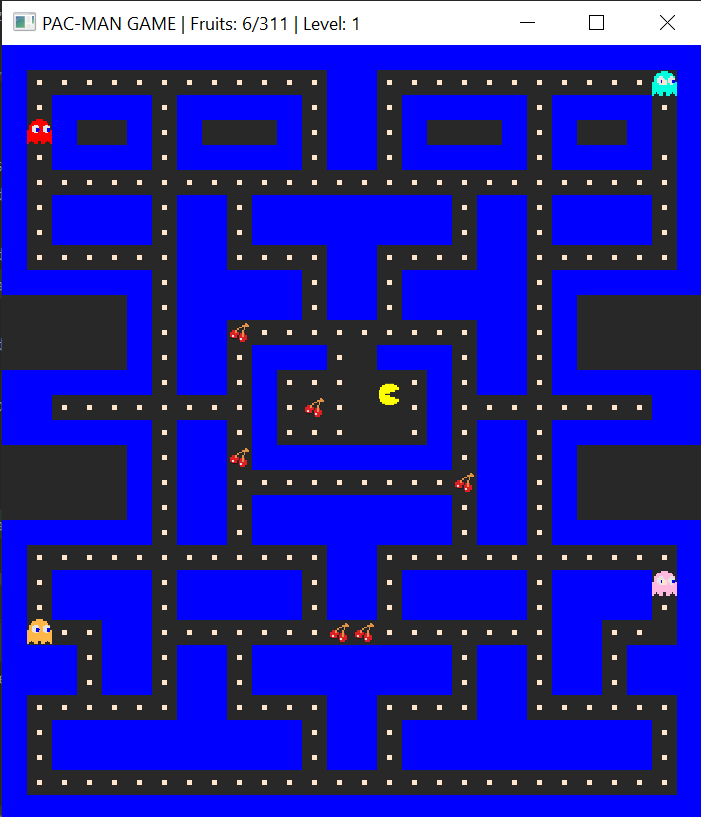
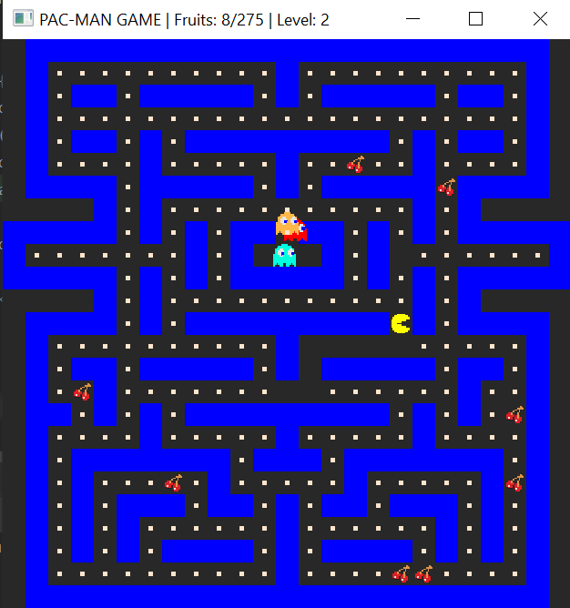

# PacManFullGame
AI PacMan game

Game contains 3 levels. 

Pacman wins if he eats all of the cookies and fruits. The counter for score is on top of the screen. 

Pacman looses if ghost caches him.

- LEVEL 1



- LEVEL 2: change of map



- LEVEL 3: change of ghost_speed

# Prerequisites
Project uses SFML library for graphics. For Windows, you can download it <a href="https://www.sfml-dev.org/download.php" target="_blank">`here`</a>

The project can be built from IDE (ex. CLion) or using cmake file.

# Logic
AI PacMan uses modified Minimax algorithm to make desicions for moves. The shortest distances for algorithm are pre-calculated with Floyd-Warshall algorithm.
The implemantation could be found in PacmanController class.
`````
static sf::Vector2f GetDecision(const Pacman& pacman, const std::deque<Ghost>& ghosts, const Path_algorithms& pathAlgorithms);
`````

Ghosts find the shortest path to pacman and takes the first step from path. Also there is a random move possibilty.
````````````
sf::Vector2f GhostController::GetDecision(const Pacman &pacman, const Ghost &ghost, const Path_algorithms& pathAlgorithms) {
    auto ghostPos = ghost.getPosition();
    auto pacmanPos = pacman.getPosition();
    auto newGhostPos = pathAlgorithms.convertCoordinatesToMaze(ghostPos);
    auto newPacmanPos = pathAlgorithms.convertCoordinatesToMaze(pacmanPos);

    std::uniform_int_distribution<> uid(0, 50);
    if (uid(gen) < 40) {
        return pathAlgorithms.getBestMove(newGhostPos, newPacmanPos);
    } else { // make random move
        auto neighbours = pathAlgorithms.getNeighbours(newGhostPos);
        int rnd = rand() % (neighbours.size());
        return neighbours[rnd];
    }
}
````````````
# Demo

